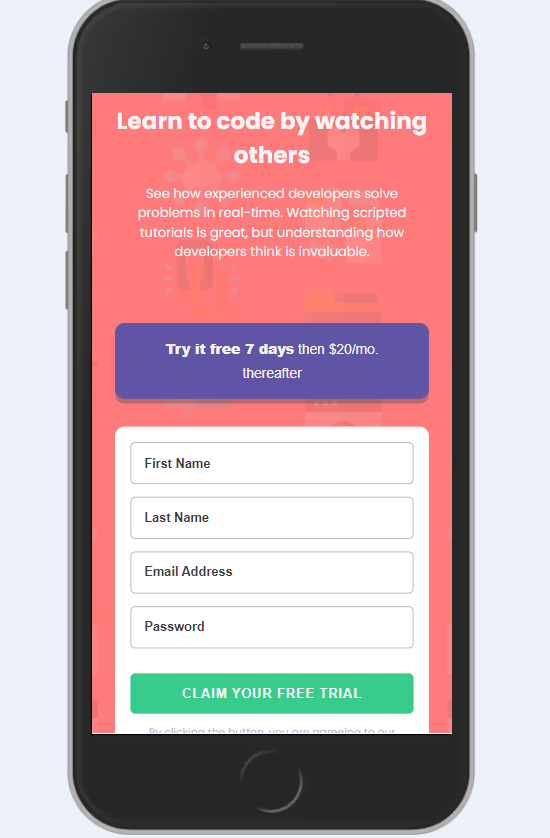
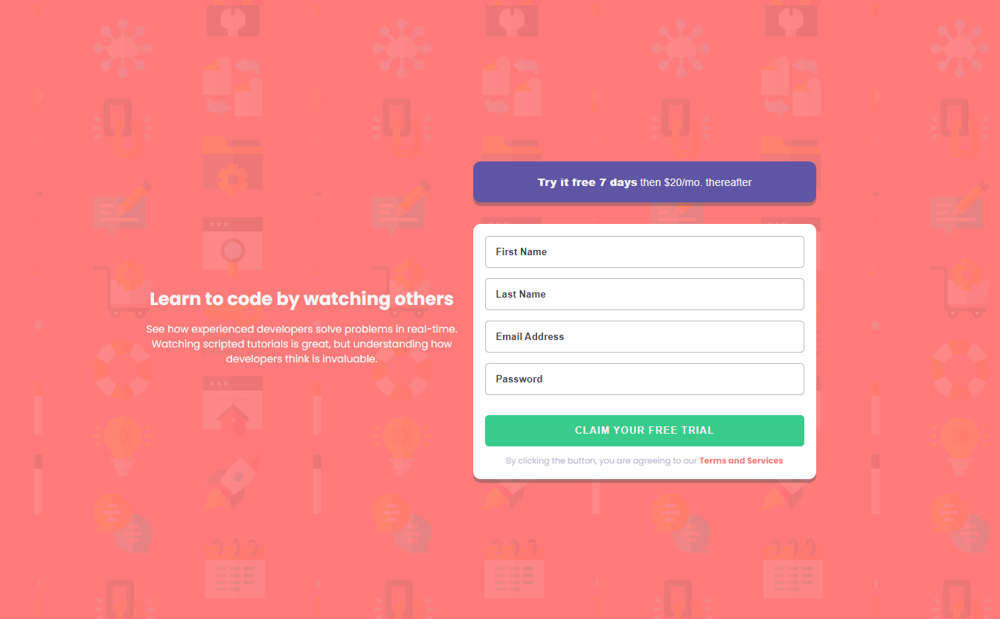

# Frontend Mentor - Intro component with sign up form solution

This is a solution to the [Intro component with sign up form challenge on Frontend Mentor](https://www.frontendmentor.io/challenges/intro-component-with-signup-form-5cf91bd49edda32581d28fd1). Frontend Mentor challenges help you improve your coding skills by building realistic projects. 

## Table of contents

- [Overview](#overview)
  - [The challenge](#the-challenge)
  - [Screenshot](#screenshot)
  - [Links](#links)
- [My process](#my-process)
  - [Built with](#built-with)
  - [What I learned](#what-i-learned)
  - [Continued development](#continued-development)
  - [Useful resources](#useful-resources)
- [Author](#author)
- [Acknowledgments](#acknowledgments)

**Note: Delete this note and update the table of contents based on what sections you keep.**

## Overview
A simple card component. Js validation script. 
### The challenge

Users should be able to:

- View the optimal layout depending on their device's screen size

### Screenshot

### Links

- Solution URL: https://www.frontendmentor.io/solutions/sign-up-component-GC38oeu5xK
- Live Site URL: https://arekr93.github.io/Signup_formComponent/

## My process

### Built with

- Semantic HTML5 markup
- CSS custom properties
- Flexbox
- Mobile-first workflow
- JS

**Note: These are just examples. Delete this note and replace the list above with your own choices**

### What I learned

The project helped me to use the basics of css and js better.

## Author

- Website - work in progress [Arkadiusz Ruszczak](https://www.your-site.com)
- Frontend Mentor - [@ArekR93](https://www.frontendmentor.io/profile/ArekR93)
